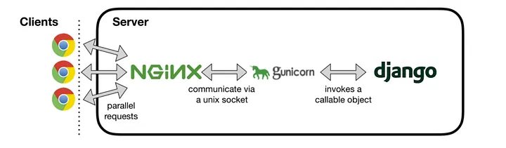

# First Website Project

## Technologies used and Development Environment Setup (MacOS):
### 1. Django
    1.1 python manage.py makemigrations
    1.2 python manage.py migrate
    1.3 python manage.py createsuperuser
        Username: admin
        Password: admin
        Email address: admin@auking.com.au
    1.4 python manage.py collectstatic
    1.5 python manage.py runserver

### 2. MySQL
    2.1 Installation - brew install mysql
    2.2 To start the service - mysql.server start
    2.3 To stop service - brew services stop mysql/mysql.server stop
    2.4 Password in setting file

### 3. Redis, as the middle layer Database
    3.1 Installation - brew install redis
    3.2 To start the service - redis-server
    3.3 To stop the service - Ctrl-C
    3.4 To retart the redis - brew services restart redis

### 4. Celery, as the delay queue for tasks
    4.1 pip install celery
    4.2 celery -A celery_tasks.tasks worker -l info

### 5. Use activation email to close the registration loop (https://www.youtube.com/watch?v=iGPPhzhXBFg)
    EMAIL_HOST = 'smtp.gmail.com'
    EMAIL_HOST_USER = 'example@gmail.com'
    EMAIL_HOST_PASSWORD = 'password'
    EMAIL_PORT = 587
    EMAIL_USE_TLS = True
    EMAIL_BACKEND = 'django.core.mail.backends.smtp.EmailBackend'

## Production Environment Setup

https://medium.com/@aadarshachapagain/setting-up-django-with-mysql-nginx-and-gunicorn-on-ubuntu-18-04-c23e1334a17

### 1. Linux Ubuntu environment setup
#### 1.1 To update/upgrade the new linux system 
    sudo apt-get update
    sudo apt-get -y upgrade

#### 1.2 To check python version
    python3 --version

#### 1.3 To download the repository from Github
    git clone repository

#### 1.4 To install and activate virtual environment
    sudo apt-get install -y python3-venv
    cd Auking
    python3 -m venv .venv
    source .venv/bin/activate
___

### 2. MySQL Server
#### 2.1 To install the mysql-server 
    sudo apt-get install -y mysql-server

#### 2.2 To login to MySQL as a root
    sudo mysql

#### 2.3 To update the password for the MySQL server (root)
    ALTER USER 'root'@'localhost' IDENTIFIED WITH mysql_native_password BY 'place-your-own-password';

#### 2.4 To update the user privileges
    FLUSH PRIVILEGES;

#### 2.5 To create the database
    create database auking;

#### 2.6 To check if MySQL is still running
    sudo systemctl status mysql
    ps aux | grep mysql

#### 2.7 To setup enviornment for mysqlclient package install
    sudo apt-get install -y python3-dev default-libmysqlclient-dev build-essential
___
### 3. Redis
#### 3.1 To install Redis
    sudo apt install lsb-release curl gpg
    
    curl -fsSL https://packages.redis.io/gpg | sudo gpg --dearmor -o /usr/share/keyrings/redis-archive-keyring.gpg

    echo "deb [signed-by=/usr/share/keyrings/redis-archive-keyring.gpg] https://packages.redis.io/deb $(lsb_release -cs) main" | sudo tee /etc/apt/sources.list.d/redis.list

    sudo apt-get update
    sudo apt-get install -y redis

#### 3.2 To check the service of Redis
    sudo systemctl status redis-server

#### 3.3 To enable the Redis if not in service
    sudo systemctl enable redis-server
    sudo systemctl start redis-server
___
### 4. To install the related Python packages
    pip install -r requirements.txt

### 5. gunicorn
#### 5.1 To install gunicorn
    pip install gunicorn
___

### 6. supervisor
#### 6.1 Objective
Supervisor is a process control system that enables users to monitor and control UNIX-like operating system processes. It assists in managing processes that should be kept running continuously in a system by providing mechanisms to start, stop, and restart processes based on configurations or events.
#### 6.2 To install supervisor
    sudo apt-get install -y supervisor
#### 6.3 Sample "gunicorn.conf" configuraiton
##### 6.3.1 Location: 
    cd /etc/supervisor/conf.d/
##### 6.3.2 To configure the "gunicorn.conf" file
    sudo touch gunicorn.conf
    sudo nano gunicorn.conf
    sudo nano /etc/supervisor/conf.d/gunicorn.conf
##### 6.3.3 Sample code for "gunicorn.conf"
    [program:Auking]
    directory=/home/ubuntu/Auking
    command=/home/ubuntu/Auking/.venv/bin/gunicorn --workers 3 --bind unix:/home/ubuntu/Auking/app.sock auking.wsgi:application
    autostart=true
    autorestart=true
    stderr_logfile=/var/log/Auking/Auking.err.log
    stdout_logfile=/var/log/Auking/Auking.out.log

    [group:Auking]
    programs:Auking

#### 6.4 To create folder for the error logs
    sudo mkdir /var/log/Auking

#### 6.5 To tell "Supervisor" to read from the configuration file
    sudo supervisorctl reread
    sudo supervisorctl update
    sudo supervisorctl status
    sudo service supervisor restart

#### 6.6 To check error logs or modify the gunicorn.conf
    less /var/log/Auking/Auking.err.log
    sudo nano /etc/supervisor/conf.d/gunicorn.conf
___
### 7. Nginx
#### 7.1 To install Nginx
    sudo apt-get install -y nginx
#### 7.2 To configure Nginx
    sudo nano /etc/nginx/nginx.conf
#### 7.3 To configure the "django.conf"
    cd /etc/nginx/sites-available
    sudo touch django.conf
    sudo nano django.conf
    sudo nano /etc/nginx/sites-available/django.conf

    server {
        listen 80;
        server_name 54.221.105.98;

        location / {
            include proxy_params;
            proxy_pass http://unix:/home/ubuntu/Auking/app.sock;
        }
    }

#### 7.4 To check if syntax is correct and put site online
    sudo ln django.conf /etc/nginx/sites-enabled
    sudo service nginx restart

___
### 8. Useful links
    https://thenounproject.com/search/icons/?iconspage=1&q=baby%20care
    https://fontawesome.com/search

