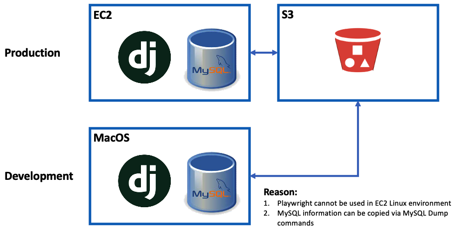
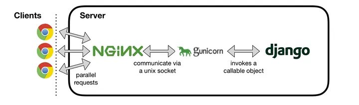

# Auking Commerce Website - First Website Project

### AWS S3 setup
#### 1. To setup S3 bucket
    To setup bucket policy

#### 2. To create IAM user
    To have access key
    
#### 3. To install AWS CLI
    If you have sudo permissions, you can install the AWS CLI for all users on the computer. We provide the steps in one easy to copy and paste group. See the descriptions of each line in the following steps.

    1. Download the file using the curl command. The -o option specifies the file name that the downloaded package is written to. In this example, the file is written to AWSCLIV2.pkg in the current folder.
    
    % curl "https://awscli.amazonaws.com/AWSCLIV2.pkg" -o "AWSCLIV2.pkg"

    2. Run the standard macOS installer program, specifying the downloaded .pkg file as the source. Use the -pkg parameter to specify the name of the package to install, and the -target / parameter for which drive to install the package to. The files are installed to /usr/local/aws-cli, and a symlink is automatically created in /usr/local/bin. You must include sudo on the command to grant write permissions to those folders.

    % sudo installer -pkg ./AWSCLIV2.pkg -target /

    After installation is complete, debug logs are written to /var/log/install.log.

    3. To verify that the shell can find and run the aws command in your $PATH, use the following commands.

    % which aws
    /usr/local/bin/aws 
    % aws --version
    aws-cli/2.10.0 Python/3.11.2 Darwin/18.7.0 botocore/2.4.5

#### 4. To configure AWS credential to support auto upload of staticfiles
    aws configure
    AWS_ACCESS_KEY_ID
    AWS_SECRET_ACCESS_KEY
    DEFAULT_REGION_NAME
    DEFAULT_OUTPUT_FORMAT

#### 5. To install python libraries
    pip install django-storages
    pip install boto3

### Technologies used and Development Environment Setup (MacOS):

### 1. Django
#### 1.1 To create new migrations based on the changes you have made to your models
    python manage.py makemigrations

#### 1.2 To apply and unapply migrations 
    python manage.py migrate

#### 1.3 To create super user 
    python manage.py createsuperuser
    Username: admin
    Password: admin
    Email address: admin@auking.com.au

#### 1.4 To collect all static files into a folder specified in settings.py - STATIC_ROOT 
    python manage.py collectstatic

#### 1.5 To run development mode server 
    python manage.py runserver
___

### 2. MySQL
#### 2.1 To install Mysql 
    brew install mysql

#### 2.2 To start the service
    brew services (services in general) will restart automatically after rebooting; the other (mysql.server start) will not.
    
    brew services start mysql
    mysql.server start
    
#### 2.3 To stop service
    brew services stop mysql
    mysql.server stop

#### 2.4 To login mysql command line mode
    mysql -u root -p
    Password in setting file

#### 2.5 To display database
    show databases;
    show tables;
    use <database name>;

#### 2.6 (optional) To check the host of user=root, if "%", can be connected outside docker, if "localhost", can only be connected within docker
    select user, host from mysql.user;
    update mysql.user set host='%' where user='root'
___

### 3. Redis, as the middle layer Database
#### 3.1 Installation
    brew install redis

#### 3.2 To start the service
    redis-server

#### 3.3 To stop the service
    Ctrl-C

#### 3.4 To retart the redis
    brew services restart redis
___

### 4. Celery, as the delay queue for tasks
#### 4.1 To install the celery
    pip install celery
     
#### 4.2 To start the celery service 
    celery -A celery_tasks.tasks worker -l info
___

### 5. Use activation email to close the registration loop (https://www.youtube.com/watch?v=iGPPhzhXBFg)
    EMAIL_HOST = 'smtp.gmail.com'
    EMAIL_HOST_USER = 'example@gmail.com'
    EMAIL_HOST_PASSWORD = 'password'
    EMAIL_PORT = 587
    EMAIL_USE_TLS = True
    EMAIL_BACKEND = 'django.core.mail.backends.smtp.EmailBackend'
___

## Production Environment Setup

https://medium.com/@aadarshachapagain/setting-up-django-with-mysql-nginx-and-gunicorn-on-ubuntu-18-04-c23e1334a17

### 1. Linux Ubuntu environment setup
#### 1.1 To update/upgrade the new linux system 
    sudo apt-get update
    sudo apt-get -y upgrade

#### 1.2 To check python version
    python3 --version

#### 1.3 To download the repository from Github
    git clone repository

#### 1.4 To install and activate virtual environment
    sudo apt-get install -y python3-venv
    cd Auking
    python3 -m venv .venv
    source .venv/bin/activate
___

### 2. MySQL Server
#### 2.1 To install the mysql-server 
    sudo apt-get install -y mysql-server

#### 2.2 To login to MySQL as a root
    sudo mysql

#### 2.3 To allow for remote access
    sudo ufw enable
    sudo ufw allow mysql

#### 2.4 To start MySQL service
    sudo systemctl start mysql

#### 2.5 To configured for remote access
    Edit the "bind-address" directive in /etc/mysql/mysql.conf.d/mysqld.cnf:

    bind-address = 127.0.0.1 (The default.)
    bind-address = XXX.XXX.XXX.XXX (The ip address of your Public Net interface.)
    bind-address = ZZZ.ZZZ.ZZZ.ZZZ (The ip address of your Service Net interface.)
    bind-address = 0.0.0.0 (All ip addresses.)

    sudo systemctl restart mysql

#### 2.6 To login MySQL shell
    mysql -u root -p

#### 2.7 To update the password for the MySQL server "root" user
    UPDATE mysql.user SET authentication_string = PASSWORD('place-your-own-password') WHERE User = 'root';
    ALTER USER 'root'@'localhost' IDENTIFIED WITH mysql_native_password BY 'place-your-own-password';

#### 2.8 To update the user privileges
    FLUSH PRIVILEGES;

#### 2.9 To create the database
    create database auking;

#### 2.10 To exit MySQL prompt line
    exit

#### 2.11 To check if MySQL is running
    sudo systemctl status mysql
    ps aux | grep mysql

#### 2.12 To setup enviornment for mysqlclient package install
    sudo apt-get install -y python3-dev default-libmysqlclient-dev build-essential

#### 2.13 To add a database user
    1. To create a new user, run the following command in the mysql shell:
    INSERT INTO mysql.user (User,Host,authentication_string,ssl_cipher,x509_issuer,x509_subject) VALUES('aukingshop','localhost',PASSWORD('aukingpassword'),'','','');

    2. To update privileges
    FLUSH PRIVILEGES;

    3. To check if new user in table
    SELECT User, Host, authentication_string FROM mysql.user;

    4. To grant database user permission
    GRANT ALL PRIVILEGES ON auking.* to aukingshop@localhost;
    FLUSH PRIVILEGES;
    SHOW GRANTS FOR 'aukingshop'@'localhost';

___
### 3. Redis
#### 3.1 To install Redis
    sudo apt install lsb-release curl gpg
    
    curl -fsSL https://packages.redis.io/gpg | sudo gpg --dearmor -o /usr/share/keyrings/redis-archive-keyring.gpg

    echo "deb [signed-by=/usr/share/keyrings/redis-archive-keyring.gpg] https://packages.redis.io/deb $(lsb_release -cs) main" | sudo tee /etc/apt/sources.list.d/redis.list

    sudo apt-get update
    sudo apt-get install -y redis

#### 3.2 To check the service of Redis
    sudo systemctl status redis-server

#### 3.3 To enable the Redis service to start automatically at system boot on systems that use systemd for service management
    sudo systemctl enable redis-server
    
#### 3.4 To run Redis at the background
    sudo systemctl start redis-server
    redis-server --daemonize yes

    redis-server
___
### 4. To install the related Python packages
    cd Auking
    source .venv/bin/activate
    pip install -r requirements.txt

### 5. gunicorn
#### 5.1 To install gunicorn
    pip install gunicorn
___

### 6. supervisor
#### 6.1 Objective
Supervisor is a process control system that enables users to monitor and control UNIX-like operating system processes. It assists in managing processes that should be kept running continuously in a system by providing mechanisms to start, stop, and restart processes based on configurations or events.
#### 6.2 To install supervisor
    sudo apt-get install -y supervisor
#### 6.3 Sample "gunicorn.conf" configuraiton
##### 6.3.1 Location: 
    cd /etc/supervisor/conf.d/
##### 6.3.2 To configure the "gunicorn.conf" file
    sudo touch gunicorn.conf
    sudo nano gunicorn.conf
    sudo nano /etc/supervisor/conf.d/gunicorn.conf
##### 6.3.3 Sample code for "gunicorn.conf"
    [program:Auking]
    directory=/home/ubuntu/Auking
    command=/home/ubuntu/Auking/.venv/bin/gunicorn --workers 3 --bind unix:/home/ubuntu/Auking/app.sock auking.wsgi:application
    autostart=true
    autorestart=true
    stderr_logfile=/var/log/Auking/Auking.err.log
    stdout_logfile=/var/log/Auking/Auking.out.log

    [group:Auking]
    programs:Auking

#### 6.4 To create folder for the error logs
    sudo mkdir /var/log/Auking

#### 6.5 To tell "Supervisor" to read from the configuration file
    sudo supervisorctl reread
    sudo supervisorctl update
    sudo supervisorctl status
    sudo service supervisor restart

#### 6.6 To check error logs or modify the "gunicorn.conf"
    less /var/log/Auking/Auking.err.log

#### 6.7 To update setting on "gunicorn.conf" if required
    sudo nano /etc/supervisor/conf.d/gunicorn.conf
___
### 7. Nginx
#### 7.1 To install Nginx
    sudo apt-get install -y nginx
#### 7.2 To configure Nginx
    sudo nano /etc/nginx/nginx.conf
    In first line, update "user www-data" -> "user root"

#### 7.3 To configure the "django.conf"
    cd /etc/nginx/sites-available
    sudo touch django.conf
    sudo nano django.conf
    sudo nano /etc/nginx/sites-available/django.conf
#### 7.4 Sample code for "django.conf"
    server {
        listen 80;
        server_name "EC2 public IP address";

        location / {
            include proxy_params;
            proxy_pass http://unix:/home/ubuntu/Auking/app.sock;
        }

        location /static {
            alias /home/ubuntu/Auking/collectstatic/;
        }
    }

#### 7.5 To check if syntax is correct and put site online
    sudo ln django.conf /etc/nginx/sites-enabled

#### 7.6 To restart server and service after making any change
    sudo service supervisor restart
    sudo service nginx restart
___

### 8. To copy .env content to server, be careful on password difference between development environment and production
___

### 9. Django setup procedures
    python manage.py makemigrations
    python manage.py migrate
    python manage.py createsuperuser
    python manage.py collectstatic

### 10. To update "ALLOWED_HOSTS" variable in "settings.py" when required
___

### 11. Celery
#### 11.1 To start the celery service 
    celery -A celery_tasks.tasks worker -l info
___

### 11. AWS S3 setup
    arn:aws:s3:::auking
    arn:aws:iam::955627195247:user/aukingAdmin

### 8. Useful links
    https://thenounproject.com/search/icons/?iconspage=1&q=baby%20care
    https://fontawesome.com/search

